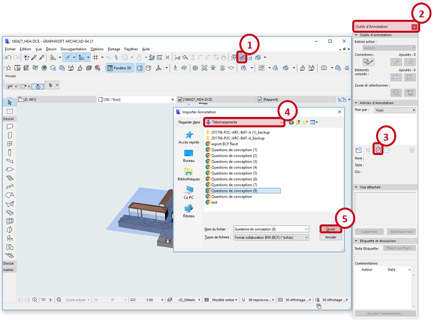
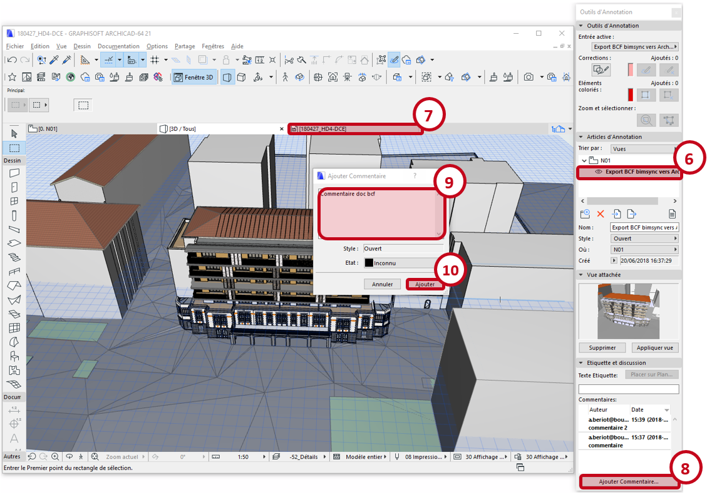
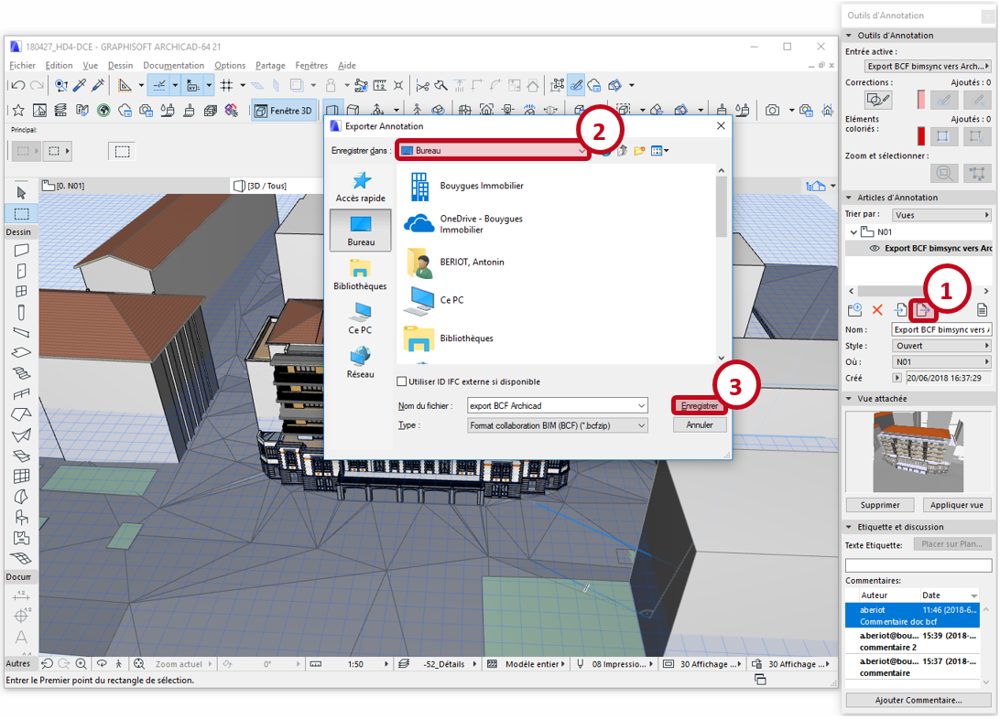

## Import d'un fichier BCFZIP dans ArchiCAD

L'interface de manipulation des fichier BFC dans ArchiCAD s'appel "Outils d'Annotation". Cliquer sur l'icône (1) pour y accéder, une nouvelle fenêtre va alors s'ouvrir (2). Pour ouvrir un fichier au format BCFZIP dans l'outils d'annotation, cliquer sur l'icône "Importer Articles d'annotation (3), puis naviguer jusque dans le dossier de téléchargement (4), sélectioner le fichier précédemment téléchargé et cliquer sur Ouvrir (5).

## Créer un nouveau commentaire

La listes des sujet va alors apparaitre dans la fenêtre Outils d'Annotation sous forme d'une liste d'articles. Cliquer sur le nom de votre sujet pour le modifier (6), et double cliquer pour ouvrir la vue correspondante dans un nouvel onglet (7).
Les commentaires sont visibles en bas de la fenêtre Outils d'Annotation, cliquer sur "Ajouter Commentaire..." (8) pour en ajouter un nouveau. Ecrire le commentaire dans la zone prévu à cet effet (9), puis valider en cliquant sur "Ajouter" (10). Ce nouveau commentaire sera ajouté à la liste des commentaires, ainsi que le nom de son auteur et sa date de création.

## Export d'un fichier BCFZIP depuis ArchiCAD

Après avoir apporté des modifications à un fichier BCF à l'aide de l'Outils d'Annotation, sélectioner les articles à exporter, puis cliquer sur "Exporter Articles d'Annotation sélectionés" (1).
Choisir un dossier d'exportation (2), un nom pour le fichier à exporter, puis cliquer sur "Enregistrer" (3). Le fichier BCF mis à jour est maintenant prêt à être réimporté dans bimsync.

