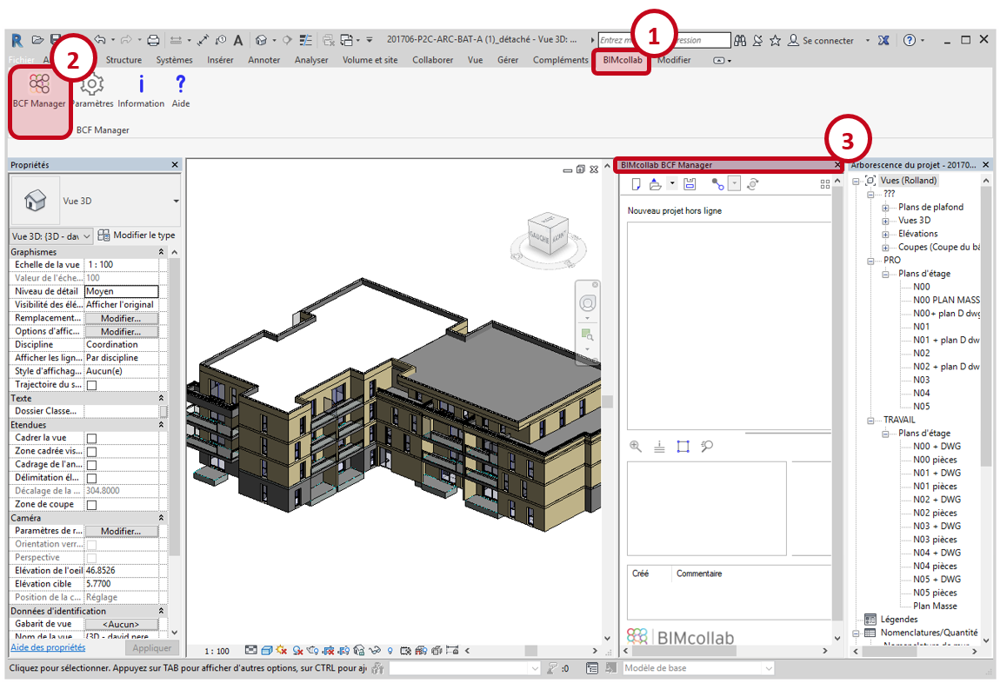
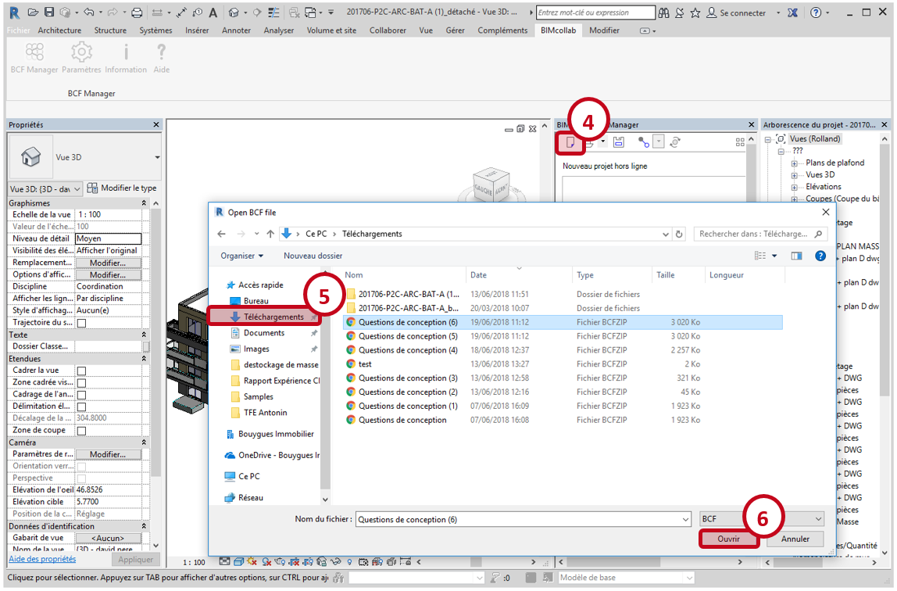
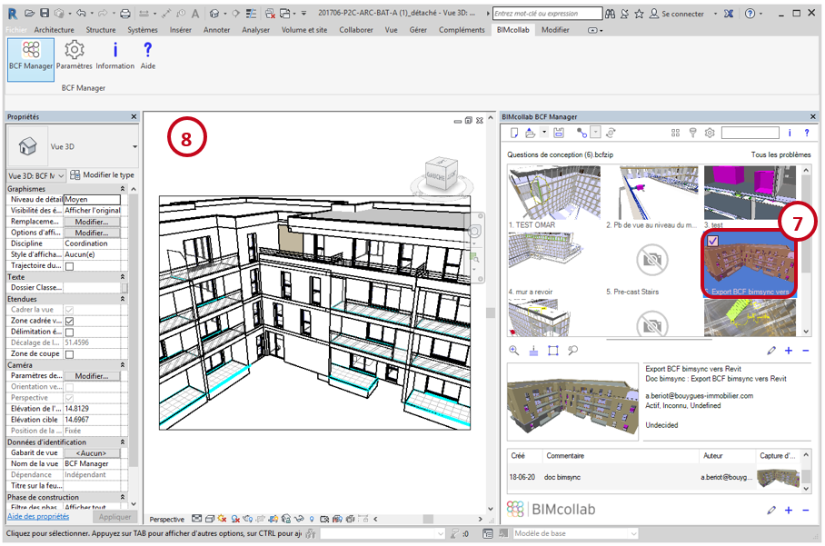
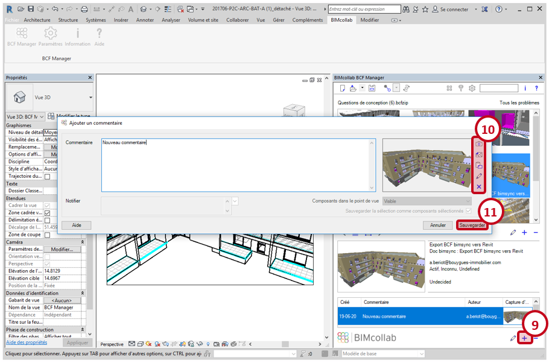
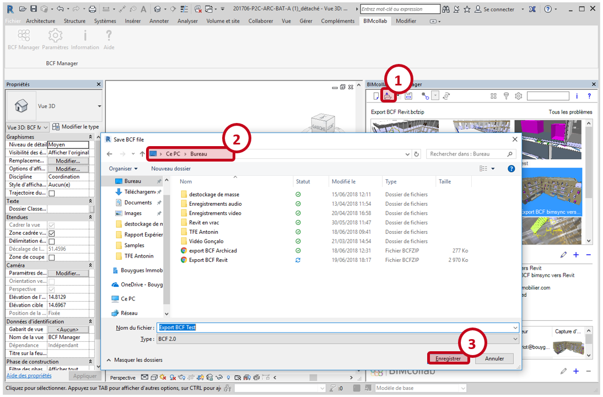

## Import d'un fichier BCFZIP dans Revit

Pour pouvoir manipuler le format BCF dans Revit, il faut passer par l'intermédiaire d'un plugin (par exemple, BIMcollab) qui doit être téléchargé puis installé sur votre poste. Dans le cas de BIMcollab, il faut se créer un compte, et l'activer avant de pouvoir ouvrir utiliser le BCF Manager, qui est l'interface permettant de manipuler les fichiers BCF. 

Une fois passé tous ces impératifs, aller dans l'onglet nouvellement créé BIMcollab (1), puis  cliquer sur BCF Manager (2) pour ouvrir l'interface, qui va alors apparaitre à droite de l'écran (3)

Pour ouvrir un fichier au format BCFZIP dans le BCF Manager, cliquer sur l'icône "Importer un fichier BCF" (4), puis naviguer jusque dans le dossier de téléchargement (5), sélectioner le fichier précédemment téléchargé et cliquer sur Ouvrir (6).

La listes des sujet va alors apparaitre dans la fenêtre BCF Manager sous forme d'une liste d'images numérotées. Cliquer sur l'image de votre sujet pour le modifier (7), et double cliquer pour ouvrir la vue correspondante dans la maquette Revit (8).

## Créer un nouveau commentaire

Les commentaires sont visibles en bas de la fenêtre du BCF Manager, cliquer sur le "+" (9) pour en ajouter un nouveau. Ecrire le commentaire dans la zone prévu à cet effet, changer l'image si besoin grâce aux outils sur la droite (10), puis valider en cliquant sur "Sauvegarder" (11). Ce nouveau commentaire sera ajouté à la liste des commentaires, ainsi que le nom de son auteur et sa date de création.

## Export d'un fichier BCFZIP depuis Revit

Après avoir apporté des modifications à un fichier BCF à l'aide de BCF Manager, cliquer sur "Exporter un fichier BCF" (1).
Choisir un dossier d'exportation (2), un nom pour le fichier à exporter, puis cliquer sur "Enregistrer" (3). Le fichier BCF mis à jour est maintenant prêt à être réimporté dans bimsync.

