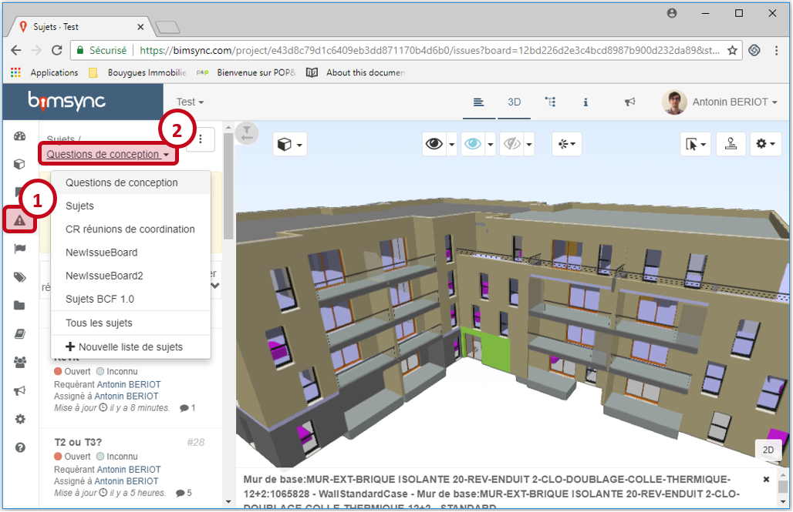
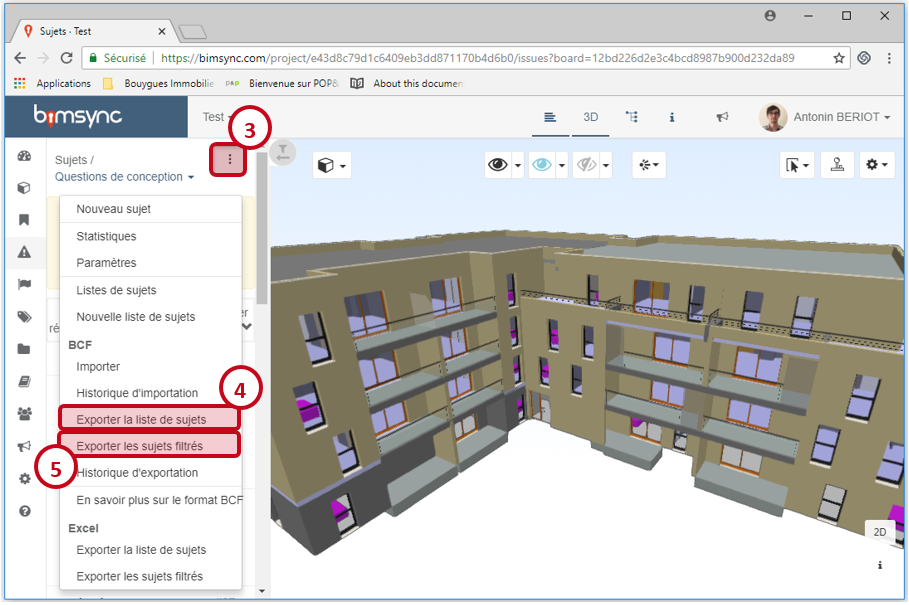
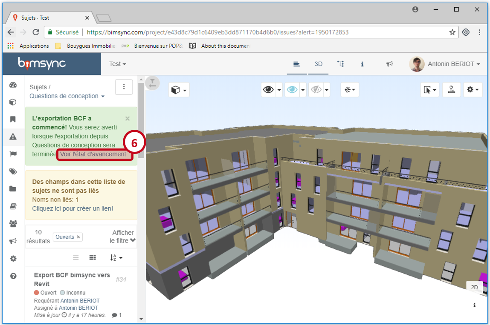
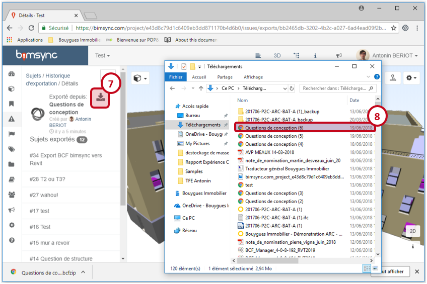
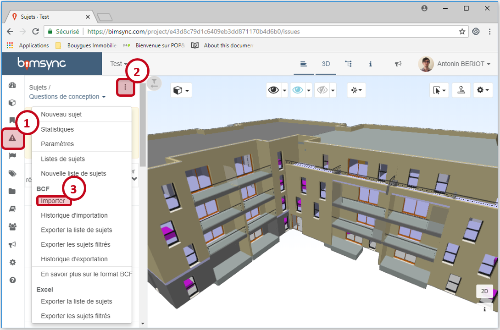
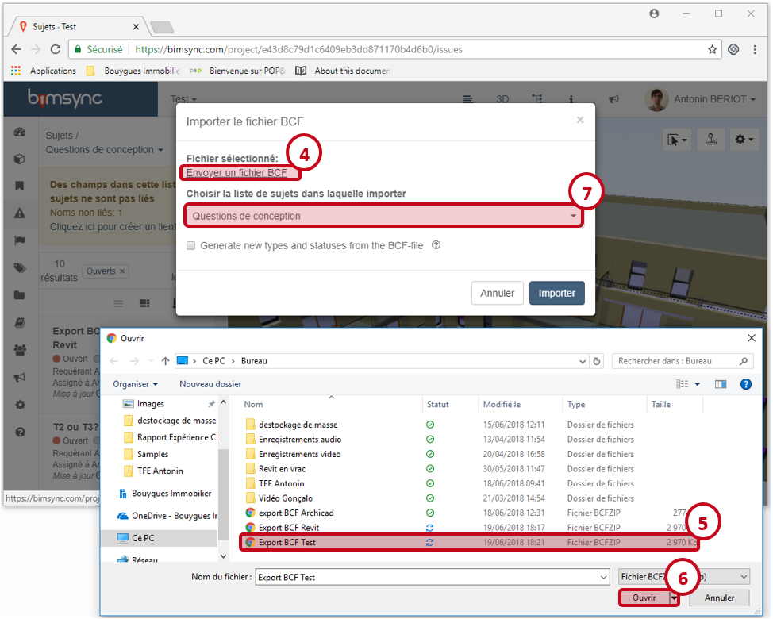
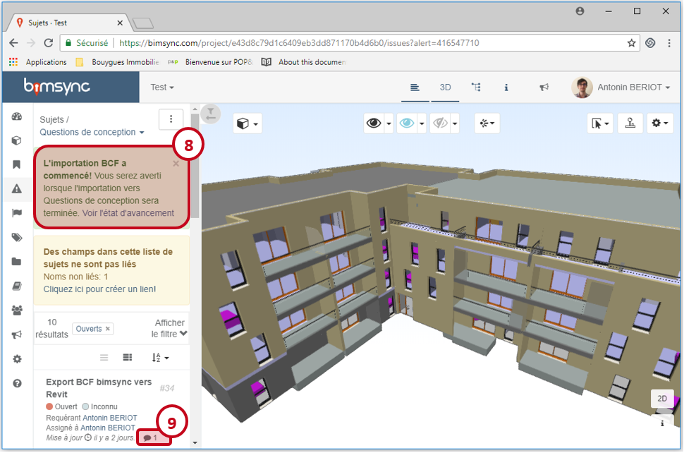
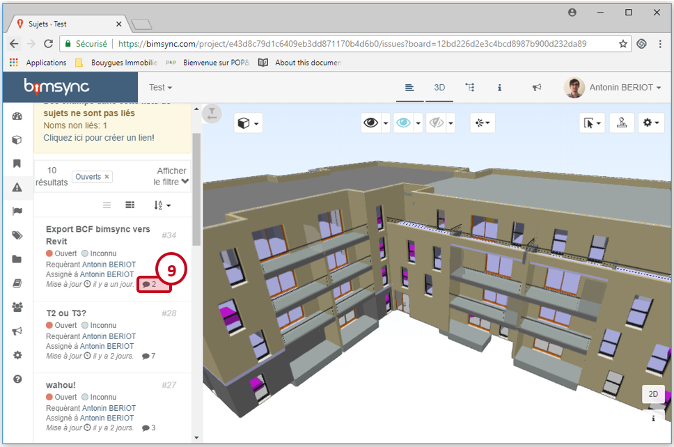
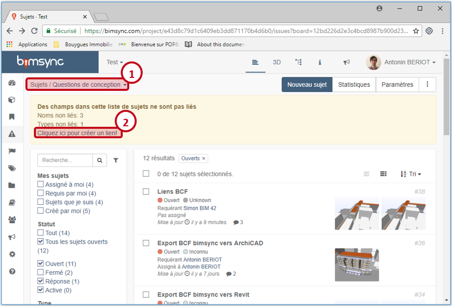
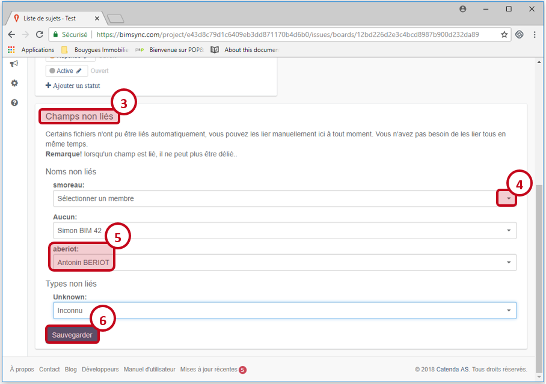

# Introduction au pricinpe du BCF

Pour échanger en utilisant le format BCF, 4 manipulations sont nécessaires :

* [Export](#export) du fichier BCF depuis bimsync
* [Import](#logiciel) de ce fichier dans un logiciel de modélisation (Revit, ArchiCAD ou Allplan) ou de revue de projet (Solibri, Navisworks, ...)
* [Export](#logiciel) d'un nouveau fichier BCF depuis le logiciel de modélisation ou de revue de projet
* [Import](#import) de ce nouveau fichier BCF dans bimsync

# Comment exporter un BCF depuis bimsync{#export}

Cliquer sur l'onglet Sujet (1), et ouvrir la listes des sujets contenant le sujet que vous voulez exporter en format BCF (2).

Cliquer ensuite sur l'icône "..." (3), puis sur "Exporter la liste des sujets" (4). Vous pouvez également choisir l'option "Exporter les sujets filtrés" (5), en ayant choisi des filtres vous convenant au préalable.

Bimsync vous indique que l'exportation a commencé, cliquer sur "voir l'état d'avancement" (6).

Une fois l'exportation terminée, cliquer sur l'icône flèche pour télécharger (7) le fichier BFC de la liste des sujets exportés. Vous trouverez ce fichier dans votre dossier de téléchargement (8) en format BCFZIP.

# Comment utiliser le BCF dans votre logiciel{#logiciel}

Les fichiers BCF téléchargés depuis bimsync peuvent être ouvert, modifiés et exportés dans votre logiciel de modélsation ou de revue de projet.

| [**BCF dans Revit**](../07-Echanger_en_BCF/echanger-en-bcf-revit.md) | [**BCF dans Archicad**](../07-Echanger_en_BCF/echanger-en-bcf-archicad.md) |
| :---: | :---: |
|  |  |

# Comment importer un BCF dans bimsync{#import}

Pour importer un fichier BCFZIP dans bimsync, aller dans l'onglet sujets (1), cliquer sur l'icône "..." (2), puis sur "Importer" (3).

Dans l'interface d'import de fichiers BCF, cliquer sur "Envoyer un fichier BCF" (4), parcourez vos documents puis sélectionner le fichier à importer (5), puis cliquer sur "Ouvrir" (6). Veiller à choisir la bonne liste de sujets dans laquelle les sujets seront importés, la même qu'au départ si les fichiers BCF ont été importé initialement depuis bimsync (7).

L'importation BCF est lancée (8), dès qu'elle sera fini les nouveau sujets seront visibles dans la liste choisie lors de l'importation, et les sujets existants seront mis à jours (les nouveaux commentaires seront ajoutés automatiquement (9) )

# Principe des liens

Lors des échanges en format BCF entre différents logiciels, il arrivent que certaine informations se perdent, ou changent. Par exemple, le nom d'utilisateur dans bimsync n'est pas nécessairement le même que dans le logiciel de modélisation. Ainsi, lors d'un échange en format BCF, il est important de préciser quels sont les correspondances entre les différents noms d'un même utilisateur. Il faut créer des liens entre ces différents noms. 

Lorsqu'il y a une ambiguïté au niveau des liens, ou que les liens n'ont pas été définis, bimsync le signal dans un cadre jaune en écrivant "Des champs dans cette liste ne sont pas liés" (1). Cliquer sur "Cliquez ici pour créer un lien" (2), pour accéder à l'interface de création de lien.

Aller ensuite dans l'onglet "Champs non liés" (3), puis mettre en correspondances les différents noms et propriétés issues du logiciel de modélisation et ceux de bimsync. Pour cela, cliquer sur la flèche (4) pour dérouler la liste des choix possibles dans bimsync pour le mêtre en lien avec le nom ou la propriété non reconnue (5).
Cliquer enfin sur "Sauvegarder" lorsque tous les liens sont établis (6).

