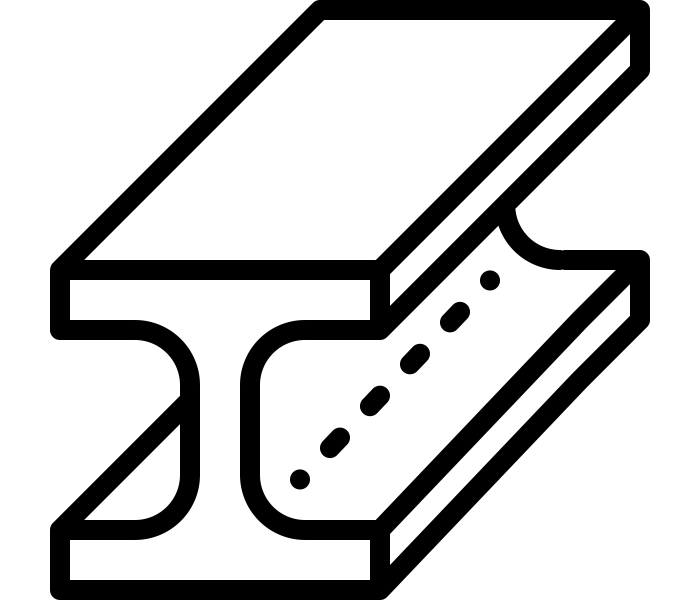
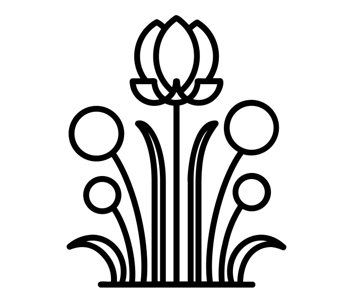
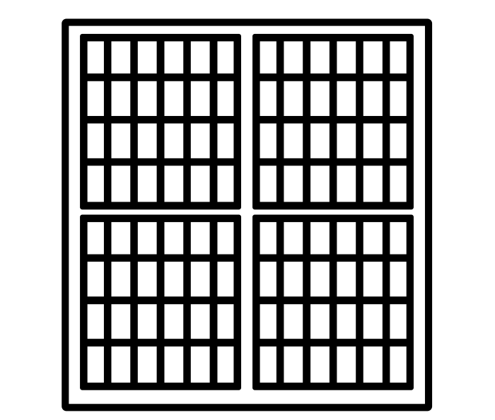
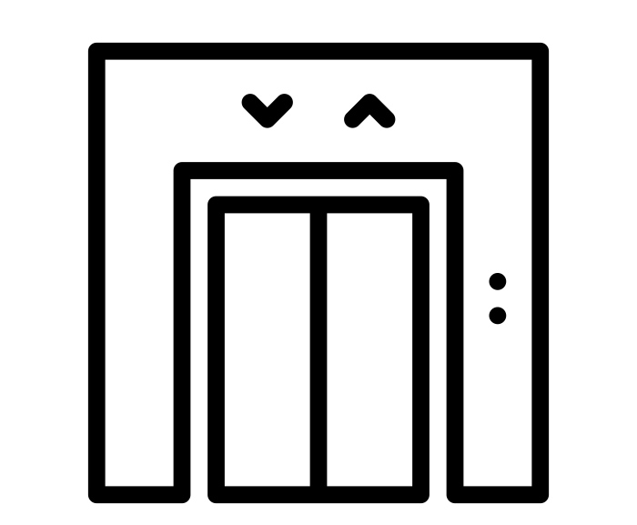
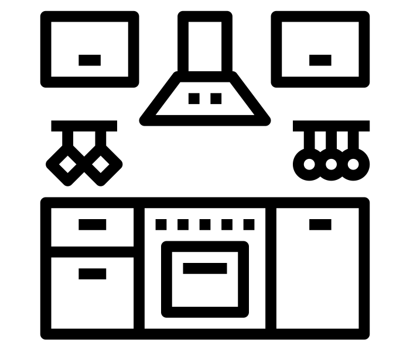
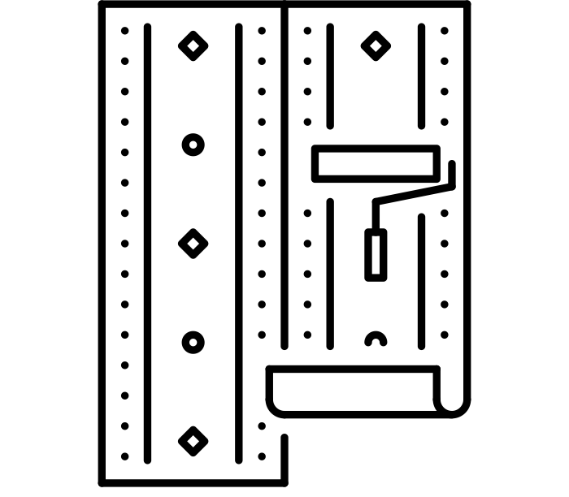
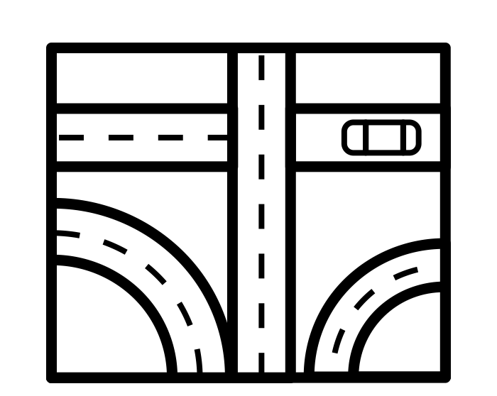
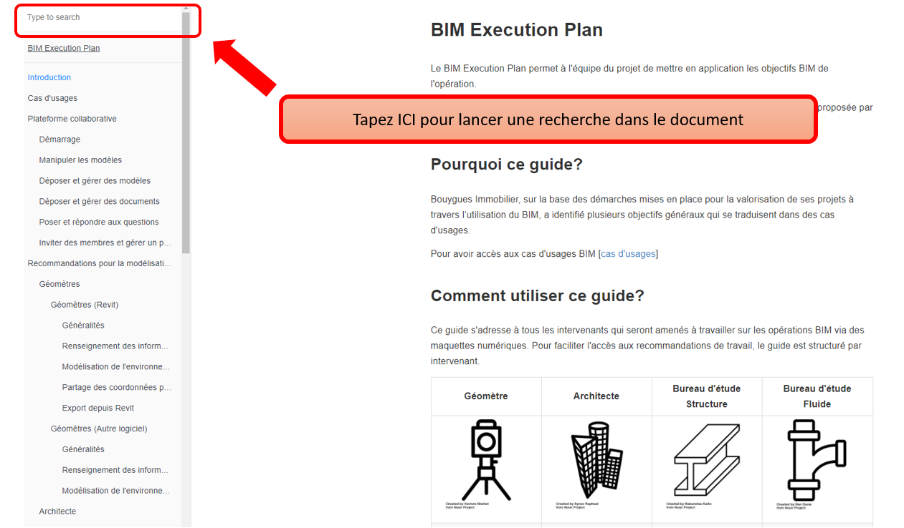

# Introduction

##  Le Cahier des charges BIM

Le Cahier des charges BIM présente la méthodologie de travail autour des modèles numériques proposée par Bouygues Immobilier sur l’ensemble de ses opération.  Le Cahier des charges BIM permet à l'équipe du projet de mettre en application les objectifs BIM de l'opération.

> Les prescriptions de ce document sont indicatives, et n’enlèvent pas au prestataire la responsabilité de les adapter au contexte du projet et au logiciel utilisé.

Ce guide est téléchargeable au format PDF

## Pourquoi ce guide? 

Bouygues Immobilier, sur la base des démarches mises en place pour la valorisation de ses projets à travers l’utilisation du BIM, a identifié plusieurs objectifs généraux qui se traduisent dans des cas d'usages.

Pour avoir accès aux cas d'usages BIM: [cas d'usages](cas-dusages.md)

## Comment utiliser ce guide?

Ce guide s'adresse à tous les intervenants qui seront amenés à travailler sur les opérations BIM via des maquettes numériques. Pour faciliter l'accès aux recommandations de travail, le guide est structuré par intervenant.

| Géomètre | Architecte | BET Structure | BET Fluide | Paysagiste |
| :---: | :---: | :---: | :---: | :---: |
|  |  |  |  |  |
| [Recommandation de modélisation](recommandations-de-modelisation/geometre.md) | [Recommandation de modélisation](recommandations-de-modelisation/architecte/) | [Recommandation de modélisation](recommandations-de-modelisation/bet-structure/) | [Recommandation de modélisation](recommandations-de-modelisation/bet-fluide/) | [Recommandation de modélisation](recommandations-de-modelisation/paysagiste/) |

| BET Façade | BET Ascenseur | Cuisiniste | Décorateur | BET VRD |
| :---: | :---: | :---: | :---: | :---: |
|  |  |  |  |  |
| [Recommandation de modélisation](recommandations-de-modelisation/bet-facade/) | [Recommandation de modélisation](recommandations-de-modelisation/bet-ascenseur/autre-logiciel/) | [Recommandation de modélisation](recommandations-de-modelisation/bet-cuisine/) | [Recommandation de modélisation](recommandations-de-modelisation/decorateur/autre-logiciel/) | [Recommandation de modélisation](recommandations-de-modelisation/bet-vrd/) |

## Comment échanger sur le projet?

Afin de soutenir une démarche collaborative parmi les intervenants sur les projets, Bouygues immobilier a mis en place une plateforme d'échange de données, modèles numériques et documents.

Pour en savoir plus sur la plateforme collaborative, cliquer sur : [Utilisation de la plateforme Bimsync](plateforme-collaborative/)

## Comment chercher des sujets?

Si vous souhaitez chercher des sujets spécifiques dans ce document, utilisez l'outil de recherche:

Image credits [here ](https://github.com/BIM-Bouygues-Immobilier/BIM-Execution-Plan/tree/2dd2261d87ee479acc1e366a1ddfa150bab032ec/CREDITS.md)

