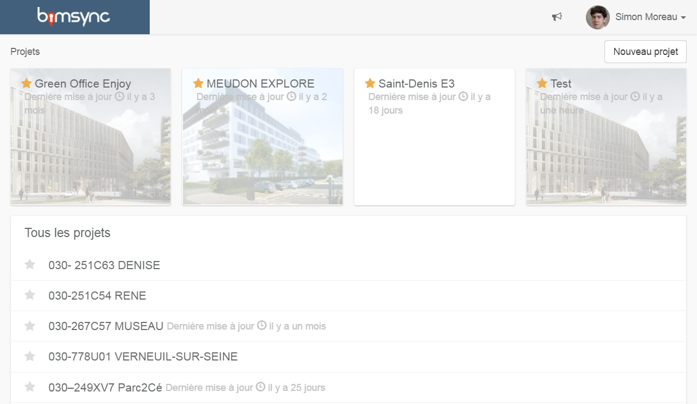

# Plateforme collaborative

Cet article permet une première prise en main de la plateforme Bimsync.

Il vous permettra notamment d’apprendre à accéder, vous connecter et créer votre compte Bimsync, ainsi que de naviguer les modèles et gérer le dépôt des fichiers et des maquettes.

## Quelques raccourcis pour débuter :

* Pour commencer à utiliser bimsync : [Démarrer](demarrage.md)
* Pour apprendre à naviguer et manipuler les modèles dans l'espace de visualisation 3D : [Manipuler les modèles](manipuler-les-modeles.md)
* Pour savoir comment déposer des modèles en format IFC : [Déposer et gérer les modèles](deposer-et-gerer-des-modeles.md)
* Pour apprendre à déposer et télécharger des documents : [Déposer et gérer les documents](deposer-et-gerer-des-documents.md)
* Pour poser et répondre à des questions : [Poser et répondre aux questions](poser-et-repondre-aux-questions.md)

