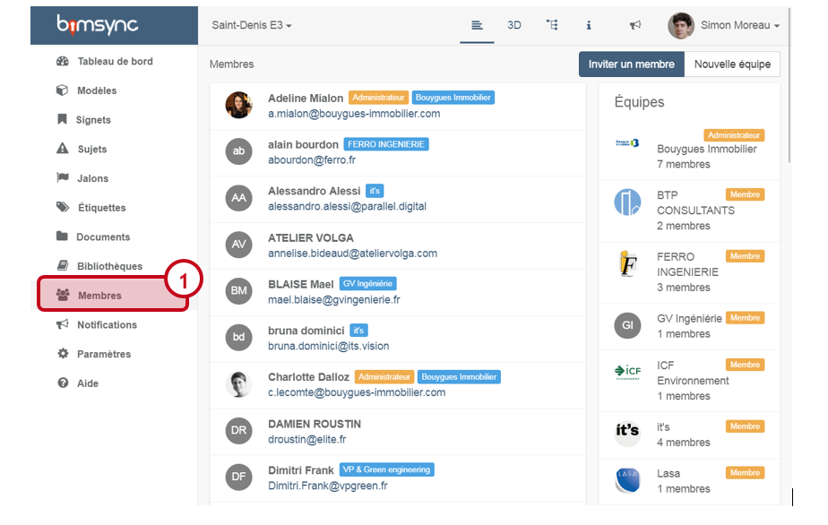
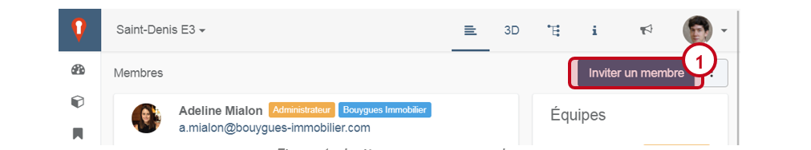
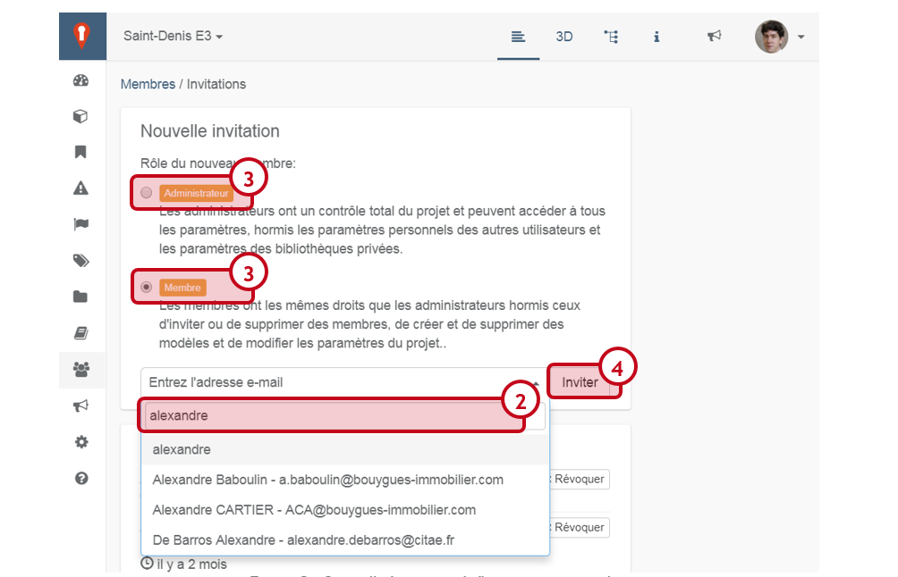
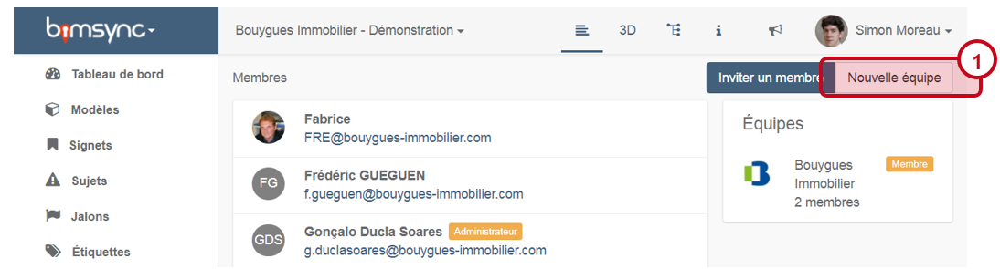
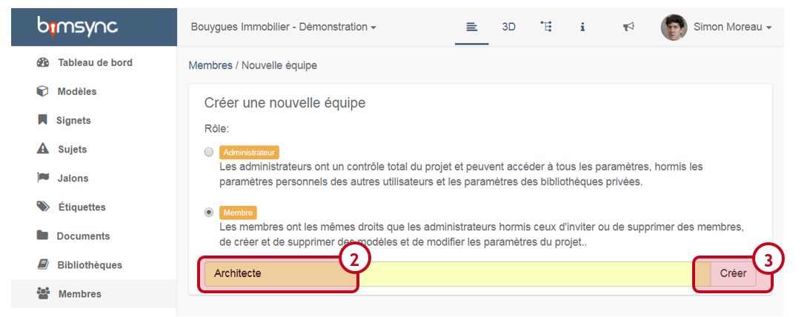
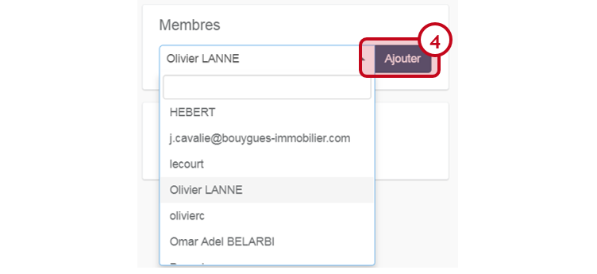

# Inviter des membres et gérer un projet

Bimsync facilite l’invitation de nouveaux contributeur, afin de permettre à l’ensemble de l’équipe projet d’accéder facilement aux informations contenues dans la plateforme.

La gestion des membres se fait via l’onglet « Membre » \(1\). Ces fonctionnalités sont réservées aux administrateurs.

## Inviter un membre

Pour inviter un nouveau membre, cliquez sur « Inviter un membre » \(1\) :

Saisissez l’adresse mail de la personne que vous souhaitez ajouter à bimsync \(2\) , et précisez si vous souhaitez que cette personne soit Administrateur ou simple Membre \(3\). Cliquez sur « Inviter » pour envoyer l’invitation \(4\) :

## Créer une équipe

Les équipes permettent de rassembler les utilisateurs en groupes afin de gérer les droits d’accès de ces utilisateurs et d’assigner une questions à un ensemble de personne.

Pour créer une équipe, cliquer sur « Nouvelle équipe » \(1\) dans l’onglet « Membres » :

Saisissez le nom de l’équipe \(2\), précisez si vous souhaitez que les membres de l’équipe soient Administrateur ou Membre, et cliquer sur « Créer » \(3\) :

Vous pouvez ensuite ajouter une image pour cette équipe.

Pour ajouter des membres à cette équipe, cliquer sur Membre, sélectionner l’utilisateur à ajouter, et cliquer sur « Ajouter » \(4\) :

### Pour en savoir plus :

Pour poser et répondre à des questions : [Poser et répondre aux questions](poser-et-repondre-aux-questions.md)

