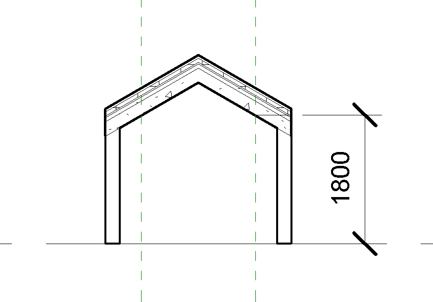
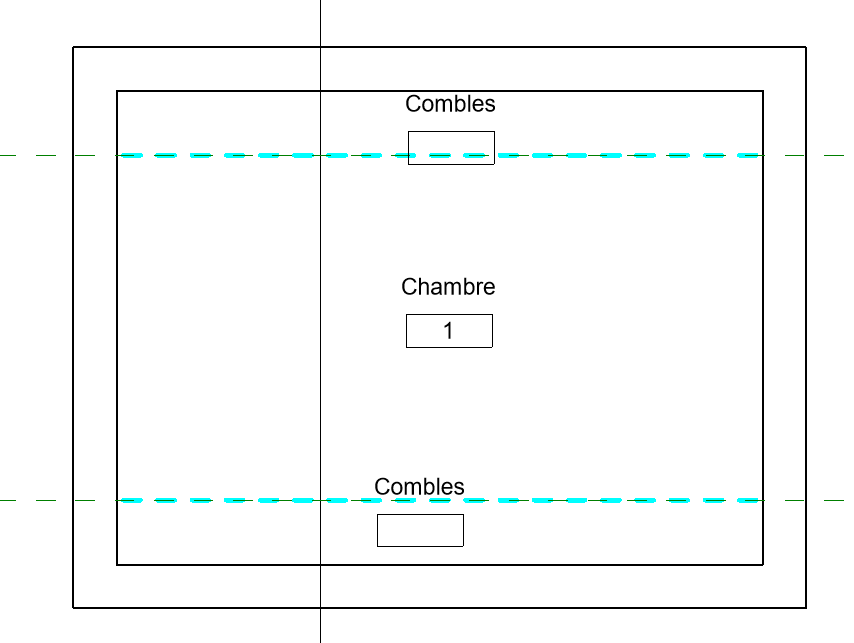
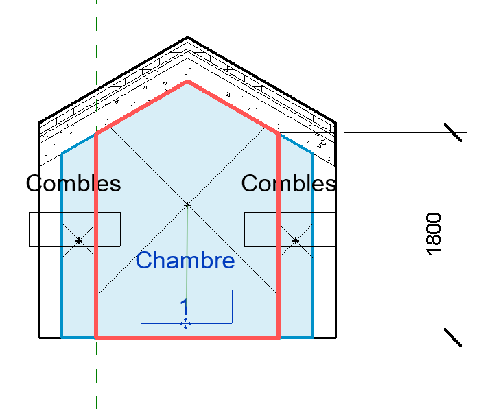

# Modélisation des combles

Concernant les combles, l'espace dont la hauteur sous plafond est de moins d'1,80m n'est pas pris en compte dans le calcul de la surface. Dans l'image ci dessous, il s'agit de l'espace à l’extérieur des deux droites en pointillés verts.

 Il faut créer une ou plusieurs pièces supplémentaires, que l'on va nommer Combles, regroupant tous les espaces dont la hauteur sous plafond est inférieure à 1,80m. Pour cela, utiliser l'outil Séparateur de pièces, comme dans l'image suivante:

Enfin, renommer correctement vos pièces. vous devez avoir une pièce principale, et une ou plusieurs pièces nommées Combles, comme sur l'image ci dessous: 

