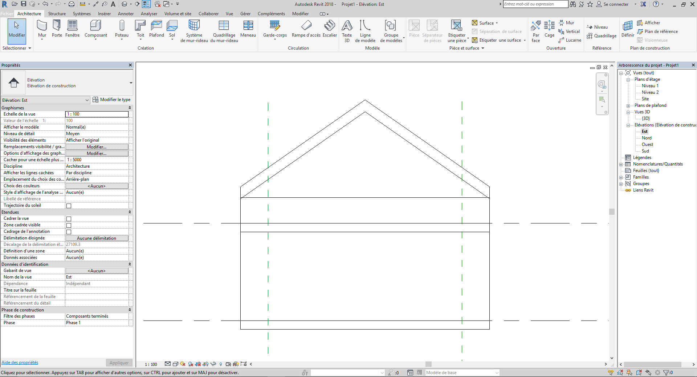
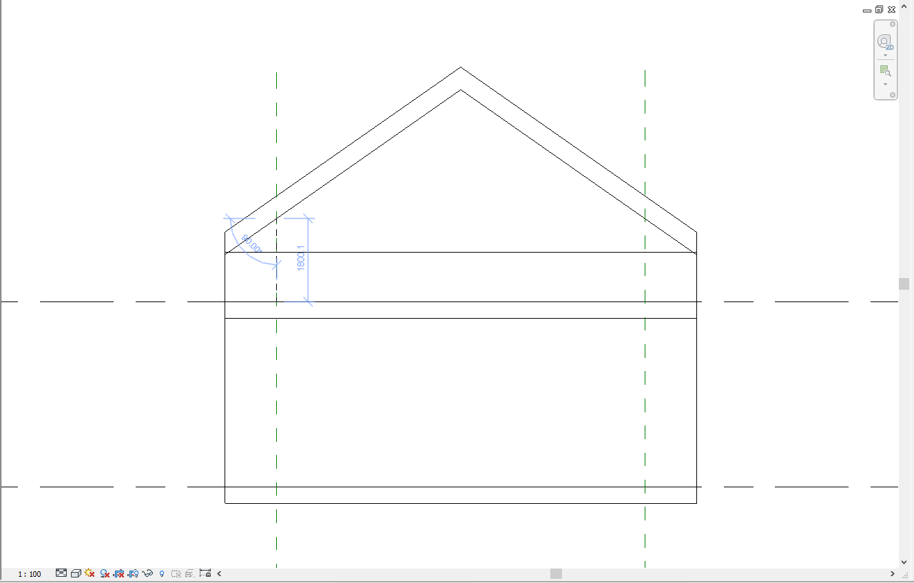
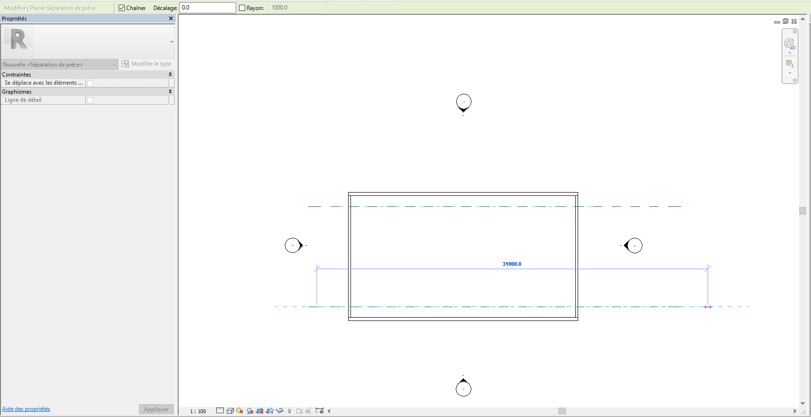
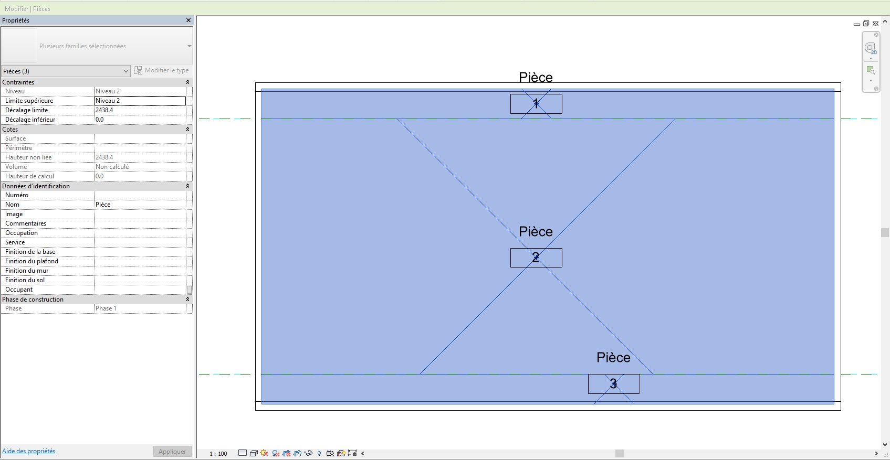

# Modélisation des combles

Concernant les combles, l'espace vendu est celui dont la hauteur sous plafond est d'au moins 1,80m. ainsi, l'espace dont la hauteur est inférieur à cette valeur n'est pas pris en compte dans le calcul de la surface, mais existe bien, et est exploitable. Dans l'image ci dessous, il s'agit de l'espace à l’extérieur des deux droites en pointillés verts.  
\[image 1\]

Pour créer et placer ces droites, allez dans l’onglet Architecture, puis cliquez sur Plan de référence tout à droite de la barre d'outils. Placez vous dans la vue d'élévation appropriée, créez 2 plans de référence, et placez les de tel sorte à ce que la distance entre le plafond et le sol soit de 1,80m, comme sur l'image ci-dessous:

Allez ensuite dans la vue Plan d'étage du niveau correspondant aux combles, \(dans notre exemple, niveau 2\), puis dans l'onglet Architecture, cliquez sur Séparateur de pièces. Tracez ensuite deux droite séparatrices de pièce, chacune superposées aux deux plans de références précédemment tracés, comme sur l'image: 

Enfin, placez vos pièces dans les différents espaces ainsi créés \(ici, 3 espaces\). Pour cela, allez dans l'onglet Architercture, puis cliquez sur Pièce, et placez une pièce dans chaque espaces, comme sur l'image suivante: 

